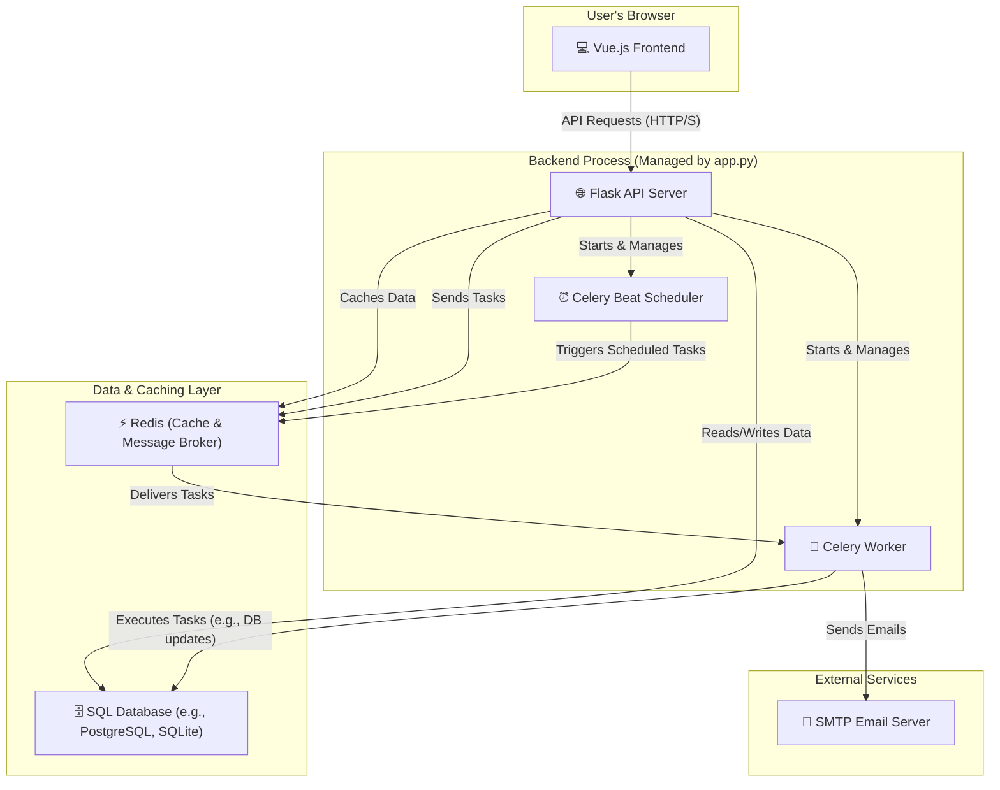

# 🌟 iSchool - The Ultimate Online Examination Platform 🚀


[](https://opensource.org/licenses/MIT)
[](http://makeapullrequest.com)

Welcome to the official repository for **iSchool**, a revolutionary, full-featured online examination and learning platform. Meticulously crafted with a powerful **Flask & Celery** backend and a dynamic, responsive **Vue.js** frontend, iSchool is designed to provide a seamless, intuitive, and engaging experience for both students and administrators.

This platform is more than just a quiz app; it's a complete ecosystem for creating, managing, and taking assessments. From its granular admin controls to its personalized user dashboards and automated reporting, every feature has been thoughtfully implemented to deliver excellence.

---

## ✨ Table of Contents

1.  [🌟 About The Project](#-about-the-project)
    *   [🎯 Core Mission](#-core-mission)
    *   [💡 Key Philosophy](#-key-philosophy)
2.  [🚀 Incredible Features](#-incredible-features)
    *   [👤 For Our Amazing Users (Students)](#-for-our-amazing-users-students)
    *   [👑 For Our Powerful Administrators](#-for-our-powerful-administrators)
    *   [⚙️ System & Architectural Marvels](#️-system--architectural-marvels)
3.  [🛠️ Tech Stack & Architecture](#️-tech-stack--architecture)
    *   [💻 Frontend (The Face of Brilliance)](#-frontend-the-face-of-brilliance)
    *   [🧠 Backend (The Engine of Power)](#-backend-the-engine-of-power)
    *   [🏗️ System Architecture Diagram](#️-system-architecture-diagram)
4.  [🗄️ Database Schema](#️-database-schema)
    *   [User Model](#user-model)
    *   [Level Model](#level-model)
    *   [Subject Model](#subject-model)
    *   [Chapter Model](#chapter-model)
    *   [Quiz Model](#quiz-model)
    *   [Question Model](#question-model)
    *   [UserQuizAttempt Model](#userquizattempt-model)
    *   [UserAnswer Model](#useranswer-model)
    *   [Admin Model](#admin-model)
5.  [🏁 Getting Started: Installation & Setup](#-getting-started-installation--setup)
    *   [📋 Prerequisites](#-prerequisites)
    *   [🔧 Backend Setup](#-backend-setup)
    *   [🎨 Frontend Setup](#-frontend-setup)
    *   [🔑 Environment Variables](#-environment-variables)
    *   [▶️ Running The Application](#️-running-the-application)
6.  [🗺️ Frontend Structure & Components](#️-frontend-structure--components)
    *   [📂 Project Structure](#-project-structure)
    *   [🧭 Vue Router (The Navigator)](#-vue-router-the-navigator)
    *   [✨ Key Component Showcase](#-key-component-showcase)
7.  [🚀 API Endpoint Documentation](#-api-endpoint-documentation)
    *   [👤 User Authentication Routes](#-user-authentication-routes)
    *   [🎓 User Experience & Dashboard Routes](#-user-experience--dashboard-routes)
    *   [📝 User Quiz & Exam Routes](#-user-quiz--exam-routes)
    *   [📊 User Data & Profile Routes](#-user-data--profile-routes)
    *   [👑 Admin Authentication Routes](#-admin-authentication-routes)
    *   [🛠️ Admin Creation (CREATE) Routes](#️-admin-creation-create-routes)
    *   [👀 Admin Viewing (READ) Routes](#-admin-viewing-read-routes)
    *   [✏️ Admin Modification (UPDATE) Routes](#️-admin-modification-update-routes)
    *   [🗑️ Admin Deletion (DELETE) Routes](#️-admin-deletion-delete-routes)
    *   [🔍 Admin Utility Routes (Search, User Control)](#-admin-utility-routes-search-user-control)
8.  [🤖 Asynchronous & Scheduled Tasks (Celery)](#-asynchronous--scheduled-tasks-celery)
    *   [💌 New Quiz Email Notifications](#-new-quiz-email-notifications)
    *   [📅 Monthly Performance Reports](#-monthly-performance-reports)
    *   [📄 On-Demand CSV Report Generation](#-on-demand-csv-report-generation)
9.  [🤝 Contributing](#-contributing)
10. [📜 License](#-license)
11. [💖 Acknowledgements & Contact](#-acknowledgements--contact)

---

## 🌟 About The Project

iSchool was born from a vision to create a digital learning environment that is both powerful for educators and delightful for learners. We noticed that many online testing platforms were either too simplistic or overly complex and clunky. Our goal was to strike the perfect balance.

### 🎯 Core Mission

Our mission is to empower educational institutions, tutors, and self-learners with a state-of-the-art tool that makes creating and taking online exams an absolute pleasure. We aim to provide detailed analytics and feedback to help users track their progress and identify areas for improvement, fostering a culture of continuous learning.

### 💡 Key Philosophy

*   **User-Centric Design:** Every pixel and every line of code is written with the end-user in mind. The Vue.js frontend ensures a snappy, intuitive, and visually stunning experience on any device.
*   **Robustness & Scalability:** The Flask backend, combined with the power of Celery for asynchronous tasks and Redis for caching and message brokering, creates a system that is not only fast but also built to handle growth.
*   **Data-Driven Insights:** We believe in the power of data. Our comprehensive summary and analytics pages, for both users and admins, turn raw scores into actionable insights.
*   **Security First:** With bcrypt for password hashing, JWT for secure sessions, and a clear separation of concerns, we prioritize the security and integrity of our users' data.

---

## 🚀 Incredible Features

iSchool is packed with a plethora of features designed to provide a holistic and enriching experience.

### 👤 For Our Amazing Users (Students)

*   ✅ **Secure & Simple Authentication:** Easy-to-use registration and login system with robust password protection.
*   ✅ **Personalized Onboarding:** A beautiful "Start Dashboard" allows users to select their levels and subjects of interest, tailoring their learning journey from the very beginning.
*   ✅ **Dynamic Main Dashboard:** A central hub showcasing bookmarked chapters and relevant upcoming quizzes, ensuring users never miss an important test.
*   ✅ **Chapter & Quiz Management:** Users can bookmark their favorite chapters for quick access, creating a personalized study guide.
*   ✅ **Detailed Chapter View:** Dive deep into any chapter to see its description and all associated quizzes in one place.
*   ✅ **Immersive, Timed Quiz Experience:** A distraction-free, timed quiz interface with a question palette for easy navigation. Answers are saved seamlessly.
*   ✅ **Instant Quiz Results & Solutions:** Upon submission, users get a detailed summary of their performance, including their score, correct answers, and their selected options for every question.
*   ✅ **Comprehensive Performance Summary:** A dedicated summary page with beautiful charts and graphs visualizing performance across subjects, chapters, and time.
*   ✅ **Powerful Search Functionality:** Users can easily search for quizzes or chapters based on various parameters.
*   ✅ **Full Profile Management:** Users can view and update their profile information, including changing their password, and have the option to delete their account.
*   ✅ **Exportable Quiz History:** Users can request a full CSV export of their quiz history, delivered straight to their email.

### 👑 For Our Powerful Administrators

*   ✅ **Secure OTP-Based Login:** Enhanced security for administrators with a One-Time Password (OTP) system sent via email.
*   ✅ **Comprehensive Admin Dashboard:** A master view of all created Levels, Subjects, and their relationships, providing a complete overview of the platform's content.
*   ✅ **Full CRUD Operations:** Intuitive interface for Creating, Reading, Updating, and Deleting every piece of content:
    *   **Levels:** Create educational tiers (e.g., Beginner, Intermediate, Advanced).
    *   **Subjects:** Add subjects within each level (e.g., Python, Mathematics).
    *   **Chapters:** Break down subjects into manageable chapters.
    *   **Quizzes:** Design detailed quizzes with titles, descriptions, marking schemes, and schedules.
    *   **Questions:** Populate quizzes with multiple-choice questions and correct answers.
*   ✅ **Granular User Control:** Admins can search for users, view their status, and block or unblock them, ensuring platform integrity.
*   ✅ **Advanced Admin Search:** A powerful search tool for admins to find any record in the system, from quizzes to user attempts, based on various parameters.
*   ✅ **Insightful Admin Summary:** A high-level summary dashboard providing key metrics about the platform's usage and content.

### ⚙️ System & Architectural Marvels

*   ✅ **Integrated Asynchronous Processing:** Utilizes **Celery** to handle long-running tasks like sending emails. In a brilliant move for developer experience, the Celery Worker and Beat Scheduler are **automatically launched as subprocesses** by the main Flask app, eliminating the need to manage separate terminals.
*   ✅ **High-Performance Caching:** Leverages a **Redis** cache to store frequently accessed data, dramatically reducing database load and speeding up page load times for both users and admins.
*   ✅ **Automated Scheduled Jobs:** Employs **Celery Beat** to run scheduled tasks, such as sending out daily new quiz notifications and monthly user performance reports, completely automatically.
*   ✅ **RESTful API Architecture:** A clean, well-documented API built with **Flask** serves as the backbone, allowing for a clear separation between the frontend and backend logic.
*   ✅ **Secure JWT Authentication:** Implements JSON Web Tokens (JWT) for stateless, secure authentication, perfect for modern single-page applications.
*   ✅ **Responsive & Modern UI:** The **Vue.js** frontend, styled with **Bootstrap** and custom CSS, is fully responsive and provides a beautiful, modern user experience on desktops, tablets, and mobile phones.
*   ✅ **ORM-based Database Interaction:** Uses **SQLAlchemy** to interact with the database, providing a robust, secure, and Pythonic way to manage data, preventing common vulnerabilities like SQL injection.

---

## 🛠️ Tech Stack & Architecture

We chose a modern, powerful, and scalable tech stack to build iSchool, ensuring a high-quality product.

### 💻 Frontend (The Face of Brilliance)

*   ✨ **Vue.js:** Our choice for a reactive, component-based, and incredibly fast user interface. Vue's gentle learning curve and powerful ecosystem allow for the rapid development of beautiful and maintainable UIs.
*   ✨ **Core Libraries:**
    *   **Vue Router:** Enables seamless client-side navigation for a smooth, single-page application (SPA) experience.
    *   **Axios:** A promise-based HTTP client for making clean, asynchronous requests to our Flask backend.
    *   **Bootstrap 5:** A world-class CSS framework used for its robust grid system, pre-styled components, and powerful modal system.
    *   **Chart.js:** A fantastic library for creating beautiful, animated, and interactive charts, bringing our summary pages to life.
    *   **Vue-Cookies:** A simple but essential library for managing browser cookies, used here to persist user and admin authentication tokens.
    *   **jwt-decode:** A lightweight library to decode JWTs on the client-side when needed.
*   ✨ **Tooling:**
    *   **Vue CLI:** The standard tooling for Vue.js development, used for serving, building, and managing the project.

### 🧠 Backend (The Engine of Power)

*   🚀 **Flask:** A lightweight and flexible Python web framework. It provides the solid foundation for our RESTful API without imposing strict structures, allowing us to build exactly what we need.
*   🚀 **Celery:** A powerful task queue, **seamlessly integrated** into the main Flask application. It's managed via Python's `subprocess` module, starting automatically with the Flask server for an incredibly simple development workflow. This handles all time-consuming operations asynchronously.
*   🚀 **Redis:** An in-memory data store used for two critical purposes:
    1.  **High-Speed Caching:** To store results of expensive database queries, making subsequent requests lightning-fast.
    2.  **Celery Message Broker:** To manage the communication between our Flask app and our Celery workers.
*   🚀 **SQLAlchemy:** The premier SQL toolkit and Object Relational Mapper (ORM) for Python. It allows us to interact with our database using Python objects, which is more secure, more readable, and less error-prone than writing raw SQL.
*   🚀 **Bcrypt & PyJWT:** A powerful duo for security. **Bcrypt** is used for hashing passwords, ensuring they are stored securely. **PyJWT** is used to create and verify JSON Web Tokens for managing user sessions.
*   🚀 **Flask-CORS:** Handles Cross-Origin Resource Sharing, allowing our Vue.js frontend (running on a different port) to securely communicate with our Flask backend.

### 🏗️ System Architecture Diagram

This diagram illustrates the beautiful and efficient flow of data and processes within the iSchool application.



---

## 🗄️ Database Schema

Our database is elegantly designed to be normalized and efficient, ensuring data integrity and performance. Here are the core models:

### User Model
Stores information about registered users.
```python
class User(db.Model):
    uuid = db.Column(db.String(12), unique=True, nullable=False, primary_key=True)
    username = db.Column(db.String(80),  nullable=False)
    email = db.Column(db.String(120), nullable=False)
    password = db.Column(db.String(120), nullable=False) # Hashed
    is_active = db.Column(db.Boolean, default=True) # For blocking users
    user_level = db.Column(db.Text) # Stores selected level UUIDs
    user_selected_subject = db.Column(db.Text) # Stores selected subject UUIDs
    user_selected_chapter = db.Column(db.Text) # Stores bookmarked chapter UUIDs
    created_at = db.Column(db.DateTime, default=datetime.utcnow)
    login_attempts = db.Column(db.Integer, default=0)
    access_token = db.Column(db.String(120))
    access_token_expiry = db.Column(db.DateTime)
```

### Level Model
Represents the main educational levels (e.g., Beginner, Advanced).
```python
class Level(db.Model):
    uuid = db.Column(db.String(12), unique=True, nullable=False, primary_key=True)
    name = db.Column(db.String(100), nullable=False)
    description = db.Column(db.Text, nullable=False)
    created_at = db.Column(db.DateTime, default=datetime.utcnow)
    subjects = db.relationship('Subject', backref='level')
```

### Subject Model
Represents subjects within a level (e.g., Math, Science).
```python
class Subject(db.Model):
    uuid = db.Column(db.String(12), unique=True, nullable=False, primary_key=True)
    level_uuid = db.Column(db.String(12), db.ForeignKey('level.uuid'), nullable=False)
    name = db.Column(db.String(100), nullable=False)
    description = db.Column(db.Text, nullable=False)
    created_at = db.Column(db.DateTime, default=datetime.utcnow)
    chapters = db.relationship('Chapter', backref='subject')
```

### Chapter Model
Represents chapters within a subject.
```python
class Chapter(db.Model):
    uuid = db.Column(db.String(12), unique=True, nullable=False, primary_key=True)
    name = db.Column(db.String(100), nullable=False)
    description = db.Column(db.Text)
    subject_uuid = db.Column(db.String(12), db.ForeignKey('subject.uuid'), nullable=False)
    created_at = db.Column(db.DateTime, default=datetime.utcnow)
```

### Quiz Model
Stores all metadata for a specific quiz.
```python
class Quiz(db.Model):
    uuid = db.Column(db.String(12), unique=True, nullable=False, primary_key=True)
    title = db.Column(db.String(200), nullable=False)
    description = db.Column(db.Text)
    max_score = db.Column(db.Integer, nullable=False)
    correct_score = db.Column(db.Float, nullable=False) 
    wrong_score = db.Column(db.Float, nullable=False) 
    chapter_uuid = db.Column(db.String(12), db.ForeignKey('chapter.uuid'), nullable=False)
    scheduled_date = db.Column(db.DateTime, nullable=False)
    duration_minutes = db.Column(db.Integer, nullable=False)
    created_at = db.Column(db.DateTime, default=datetime.utcnow)
    total_questions = db.Column(db.Integer, nullable=False)
```

### Question Model
Stores the individual questions for each quiz.
```python
class Question(db.Model):
    uuid = db.Column(db.String(12), unique=True, nullable=False, primary_key=True)
    quiz_uuid = db.Column(db.String(12), db.ForeignKey('quiz.uuid'), nullable=False)
    question_statement = db.Column(db.Text, nullable=False)
    option1 = db.Column(db.String, nullable=False)
    option2 = db.Column(db.String, nullable=False)
    option3 = db.Column(db.String, nullable=False)
    option4 = db.Column(db.String, nullable=False)
    correct_option = db.Column(db.CHAR, nullable=False) # 'A', 'B', 'C', or 'D'
    created_at = db.Column(db.DateTime, default=datetime.utcnow)
```

### UserQuizAttempt Model
Logs each time a user attempts a quiz, storing their final score.
```python
class UserQuizAttempt(db.Model):
    uuid = db.Column(db.String(12), primary_key=True)
    user_uuid = db.Column(db.String(12), db.ForeignKey('user.uuid'), nullable=False)
    quiz_uuid = db.Column(db.String(12), db.ForeignKey('quiz.uuid'), nullable=False)
    timestamp = db.Column(db.DateTime, default=datetime.utcnow)
    score = db.Column(db.Integer, nullable=False)
    attempt_number = db.Column(db.Integer, nullable=False, default=0)
```

### UserAnswer Model
Stores every single answer a user submits for a question in a specific attempt.
```python
class UserAnswer(db.Model):
    uuid = db.Column(db.String(12), primary_key=True)
    user_uuid = db.Column(db.String(12), db.ForeignKey('user.uuid'), nullable=False)
    attempt_no = db.Column(db.Integer, db.ForeignKey('user_quiz_attempt.attempt_number'), nullable=False)
    quiz_uuid = db.Column(db.String(12), db.ForeignKey('quiz.uuid'), nullable=False) 
    question_uuid = db.Column(db.String(12), db.ForeignKey('question.uuid'), nullable=False)
    selected_option = db.Column(db.CHAR, nullable=False)
    is_correct = db.Column(db.Integer, nullable=False) # 1 for correct, 0 for incorrect
    created_at = db.Column(db.DateTime, default=datetime.utcnow)
```

### Admin Model
A simple model to store admin credentials and tokens for OTP verification.
```python
class Admin(db.Model):
    uuid = db.Column(db.String(12), primary_key=True, default="ADMIN") 
    admin_email = db.Column(db.String(120), nullable=False, default="devproject2024@gmail.com")  
    admin_token = db.Column(db.String(120), nullable=True) # Stores the OTP
```

---

## 🏁 Getting Started: Installation & Setup

Follow these steps to get a local copy of iSchool up and running on your machine.

### 📋 Prerequisites

You will need the following software installed on your system:
*   **Python** (3.8 or higher)
*   **Node.js** and **npm** (or yarn)
*   **Redis Server**

### 🔧 Backend Setup

1.  **Clone the repository:**
    ```sh
    git clone https://github.com/your-username/ischool-repo.git
    cd ischool-repo/backend
    ```

2.  **Create and activate a virtual environment:**
    *   On macOS/Linux:
        ```sh
        python3 -m venv venv
        source venv/bin/activate
        ```
    *   On Windows:
        ```sh
        python -m venv venv
        .\venv\Scripts\activate
        ```

3.  **Install Python dependencies:**
    ```sh
    pip install -r requirements.txt
    ```

4.  **Set up environment variables:**
    Create a file named `.env` in the `backend` directory and populate it with the necessary keys. See the [Environment Variables](#-environment-variables) section below for the template.

### 🎨 Frontend Setup

1.  **Navigate to the frontend directory:**
    ```sh
    cd ../frontend 
    ```

2.  **Install Node.js dependencies:**
    ```sh
    npm install
    ```

### 🔑 Environment Variables

Create a `.env` file in the `backend` directory and add the following content. **Remember to replace the placeholder values with your actual secrets!**

```env
# Database Configuration
SQLALCHEMY_DATABASE_URI='sqlite:///ischool.db' # Or your PostgreSQL/MySQL connection string
SQLALCHEMY_TRACK_MODIFICATIONS=False

# Security Keys
SECRET_KEY='your_super_secret_flask_key_for_sessions'
JWT_SECRET_KEY='your_super_secret_jwt_key_for_tokens'
BCRYPT_LOG_ROUNDS=12

# Redis & Celery Configuration
REDIS_CACHE_URL='redis://localhost:6379/0'
CELERY_BROKER_URL='redis://localhost:6379/1'
CELERY_RESULT_BACKEND_URL='redis://localhost:6379/2'

# CORS Configuration
CORS_ENABLED=True
CORS_ORIGINS='http://localhost:8080' # The address of your Vue.js frontend

# Mail Server Configuration (for OTPs and Reports)
MAIL_SERVER='smtp.gmail.com'
MAIL_PORT=587
MAIL_USERNAME='your-email@gmail.com'
MAIL_PASSWORD='your_gmail_app_password' # Use an App Password for security
```

### ▶️ Running The Application

Thanks to the brilliant integrated startup script, running the entire application is incredibly simple!

1.  **Start the Redis Server 🟢**
    Make sure your Redis server is running. If you installed it via a package manager, it might already be running as a service. Otherwise, start it manually in a terminal:
    ```sh
    redis-server
    ```

2.  **Start the Entire Backend 🧠**
    *Navigate to the `backend` directory and activate your virtual environment.* Then, run a single command:
    ```sh
    python app.py
    ```
    This one command is pure magic! It will:
    *   ✅ Start the **Flask** web server.
    *   ✅ Automatically start the **Celery Worker** in the background.
    *   ✅ Automatically start the **Celery Beat Scheduler** in the background.
    *   ✅ Create the database and tables on the first run.

3.  **Start the Frontend 🎨**
    *In a new terminal, navigate to the `frontend` directory.*
    ```sh
    npm run serve
    ```
    This will start the Vue development server, typically on `http://localhost:8080`.

🎉 **Congratulations!** You can now access the iSchool application by navigating to `http://localhost:8080` in your web browser. The entire platform is up and running!

---

## 🗺️ Frontend Structure & Components

The frontend is a beautifully structured Vue.js Single Page Application (SPA) designed for maintainability and a great developer experience.

### 📂 Project Structure
```
frontend/
├── public/
│   └── index.html      # Main HTML template
├── src/
│   ├── assets/         # Images, logos, etc.
│   ├── components/     # Reusable components (if any)
│   ├── router/
│   │   └── index.js    # All application routes
│   ├── views/
│   │   ├── admin/      # Components for the Admin Panel
│   │   ├── user/       # Components for the User/Student Panel
│   │   ├── Error/
│   │   │   └── 404.vue # Not Found page
│   │   └── index.vue   # The main landing page
│   ├── App.vue         # Root Vue component
│   └── main.js         # Entry point of the application
├── package.json
└── vue.config.js
```

### 🧭 Vue Router (The Navigator)
The `router/index.js` file is the heart of the application's navigation. It defines all the paths and maps them to their corresponding Vue components, creating a seamless user journey. It elegantly handles routes for both the user and admin sections, as well as the 404 error page.

### ✨ Key Component Showcase

*   `index.vue`: The stunning landing page that serves as the gateway to the application, directing users to either the student or admin login.
*   `user/login.vue` & `user/register.vue`: Clean, modern, and intuitive forms for user authentication.
*   `user/start_dashboard.vue`: A brilliant onboarding experience where users select their initial learning preferences.
*   `user/dashboard.vue`: The user's personalized hub, dynamically displaying chapters and quizzes.
*   `user/quiz_attempt.vue`: The immersive, timed quiz-taking interface. A masterpiece of user experience design.
*   `user/quizsolution.vue`: Provides instant, detailed feedback on quiz performance.
*   `user/summary.vue`: A data visualization powerhouse, featuring multiple charts to track user progress.
*   `admin/admin_login.vue`: The secure, OTP-based login portal for administrators.
*   `admin/admin_dashboard.vue`: The central command center for admins to view and manage all educational levels.
*   `admin/view_*.vue` (e.g., `view_chapter.vue`): A suite of components that provide detailed views and CRUD operations for every content type (subjects, chapters, quizzes).
*   `Error/404.vue`: A friendly and helpful "Not Found" page to gracefully handle invalid URLs.

---

## 🚀 API Endpoint Documentation

Our backend exposes a comprehensive and well-structured RESTful API. All user-facing routes require a valid JWT `token` passed as a query parameter. Admin routes require a valid `admin_token`.

### 👤 User Authentication Routes

| Method | Endpoint         | Description                                                              | Request Body (Form Data)      | Success Response (200)                                                              | Error Responses                               |
| :----- | :--------------- | :----------------------------------------------------------------------- | :---------------------------- | :---------------------------------------------------------------------------------- | :-------------------------------------------- |
| `POST` | `/register`      | Creates a new user account.                                              | `username`, `email`, `password` | `{"message": "User registered successfully!"}`                                      | `409`: User already exists.                   |
| `POST` | `/login`         | Authenticates a user and returns a JWT.                                  | `identifier`, `password`      | `{"message": "Login successful", "login_attempt": 0, "token": "jwt_token"}`         | `401`: Invalid credentials.                   |

### 🎓 User Experience & Dashboard Routes

| Method | Endpoint                           | Description                                                              | Request Body (JSON)         | Success Response (200)                                                              |
| :----- | :--------------------------------- | :----------------------------------------------------------------------- | :-------------------------- | :---------------------------------------------------------------------------------- |
| `GET`  | `/api/level_info`                  | Fetches all available levels for the initial setup.                      | -                           | `{"message": "...", "info": [level_data]}`                                          |
| `POST` | `/api/start/select_level`          | Saves the user's selected levels and returns relevant subjects.          | `{"level_name": "level_id"}` | `{"message": "...", "subjects": [subject_data]}`                                    |
| `POST` | `/api/start/select_sub`            | Saves the user's selected subjects.                                      | `{"sub_name": "sub_id"}`    | `{"message": "sub selected successfully"}`                                          |
| `GET`  | `/dashboard/chapter_n_quiz`        | Fetches bookmarked chapters and quizzes for the main dashboard.          | -                           | `{"message": "...", "chapters": [...], "quiz": [...]}`                               |
| `GET`  | `/dashboard/chapter_preference`    | Fetches all chapters from the user's selected subjects for bookmarking.  | -                           | `{"message": "...", "all_chapters": [...]}`                                         |
| `POST` | `/dashboard/user_chapter_preference` | Saves the user's bookmarked chapters.                                    | `{"chap_name": "chap_id"}`  | `{"message": "User selected chapter stored successfully"}`                          |
| `GET`  | `/chapter/chapter_det_with_quiz/<chapter_id>` | Gets detailed information for a specific chapter and its quizzes. | -                           | `{"message": "...", "chapter_info": [...]}`                                         |

### 📝 User Quiz & Exam Routes

| Method | Endpoint                               | Description                                                              | Request Body (JSON)             | Success Response (200)                                                              |
| :----- | :------------------------------------- | :----------------------------------------------------------------------- | :------------------------------ | :---------------------------------------------------------------------------------- |
| `GET`  | `/quiz_info_start`                     | Fetches all necessary data to start a quiz (questions, timer, etc.).     | - (Query: `quiz_id`)            | `{"quiz_data": [...]}`                                                              |
| `POST` | `/quiz_submit/<quiz_id>/<attempt_number>` | Submits the user's answers for a quiz attempt.                           | `{"userAnswers": {...}}`         | `200 OK`                                                                            |
| `GET`  | `/quiz_summary_info/<quiz_id>/<attempt_number>` | Fetches the complete results and solutions for a quiz attempt. | -                               | `{"quiz_details": ..., "score": ..., "questions": ..., "user_answer": ..., "correct_answer": ...}` |

### 📊 User Data & Profile Routes

| Method | Endpoint             | Description                                                              | Request Body (Form Data)        | Success Response                                                                    |
| :----- | :------------------- | :----------------------------------------------------------------------- | :------------------------------ | :---------------------------------------------------------------------------------- |
| `GET`  | `/u_summary_page`    | Fetches all data needed for the user's comprehensive summary page charts. | -                               | `{"message": "...", "summary": {...}}`                                              |
| `POST` | `/u/export_summary`  | Triggers a Celery task to generate and email a CSV report of user's history. | -                               | `202 Accepted`: `{"message": "Your report is being generated..."}`                  |
| `POST` | `/u/search`          | Performs a search based on user-provided parameters.                     | `parameter`, `querry`           | `{"message": "...", "search_result": [...]}`                                        |
| `GET`  | `/u/profile`         | Fetches the current user's profile data.                                 | -                               | `{"message": "...", "user_data": {...}}`                                            |
| `POST` | `/u/profile/edit`    | Updates the user's profile information (email, password).                | `id`, `username`, `email`, `password` | `{"message": "User profile updated successfully"}`                                  |
| `POST` | `/u/profile/delete`  | Deletes the current user's account and all associated data.              | -                               | `{"message": "User profile deleted successfully"}`                                  |

### 👑 Admin Authentication Routes

| Method | Endpoint          | Description                                                              | Request Body (Form Data) | Success Response (200)                                                              | Error Responses                               |
| :----- | :---------------- | :----------------------------------------------------------------------- | :----------------------- | :---------------------------------------------------------------------------------- | :-------------------------------------------- |
| `POST` | `/api/request_otp`| Sends an OTP to the provided admin email address.                        | `email`                  | `{"message": "OTP has been sent..."}`                                               | `404`: Admin not found.                       |
| `POST` | `/api/verify_otp` | Verifies the OTP and returns an admin JWT upon success.                  | `email`, `otp`           | `{"message": "OTP verified successfully", "admin_token": "jwt_token"}`              | `401`: Invalid OTP.                           |

### 🛠️ Admin Creation (CREATE) Routes

| Method | Endpoint                                                              | Description                                                              | Request Body (Form Data / JSON)                                                                                             | Success Response (200)                                                              |
| :----- | :-------------------------------------------------------------------- | :----------------------------------------------------------------------- | :-------------------------------------------------------------------------------------------------------------------------- | :---------------------------------------------------------------------------------- |
| `POST` | `/admin_dashboard/create/level`                                       | Creates a new educational level.                                         | `level_name`, `level_description`                                                                                           | `{"message": "...", "level_id": "..."}`                                             |
| `POST` | `/admin_dashboard/<level_id>/create/subject`                          | Creates a new subject within a specified level.                          | `subject_name`, `subject_description`                                                                                       | `{"message": "...", "subject_id": "..."}`                                           |
| `POST` | `/admin_dashboard/<level_id>/level/<subject_id>/subject/create/chapter` | Creates a new chapter within a specified subject.                        | `chapter_name`, `chapter_description`                                                                                       | `{"message": "...", "chapter_id": "..."}`                                           |
| `POST` | `/admin_dashboard/.../chapter/create/quiz`                            | Creates a new quiz within a specified chapter.                           | `quizTitle`, `quizDescription`, `quizMaxMarks`, `quizcorrectscore`, `quizwrongscore`, `quizScheduledDate`, `quizMaxTime`, `quiztotalquestion` | `{"message": "...", "quiz_id": "..."}`                                              |
| `POST` | `/api/admin_dashboard/.../quiz/create/question`                       | Creates multiple questions for a quiz from a JSON payload.               | JSON object with question data                                                                                              | `{"message": "Questions created successfully"}`                                     |

### 👀 Admin Viewing (READ) Routes

| Method | Endpoint                                                              | Description                                                              | Success Response (200)                                                              |
| :----- | :-------------------------------------------------------------------- | :----------------------------------------------------------------------- | :---------------------------------------------------------------------------------- |
| `GET`  | `/api/admin_dashboard`                                                | Fetches all levels and their associated subjects for the main admin dashboard. | `{"message": "...", "info": [...]}`                                                  |
| `GET`  | `/api/admin_dashboard/level/<level_id>`                               | Fetches details for a specific level and its subjects.                   | `{"message": "...", "info": [...]}`                                                  |
| `GET`  | `/api/admin_dashboard/subject/<subject_id>`                           | Fetches details for a specific subject and its chapters.                 | `{"message": "...", "info": [...]}`                                                  |
| `GET`  | `/api/admin_dashboard/.../<chapter_id>`                               | Fetches details for a specific chapter and its quizzes.                  | `{"message": "...", "info": [...]}`                                                  |
| `GET`  | `/api/admin_dashboard/.../quiz/get_questions`                         | Fetches all questions for a specific quiz.                               | `{"message": "...", "info": [...]}`                                                  |

### ✏️ Admin Modification (UPDATE) Routes

| Method | Endpoint                                                              | Description                                                              | Request Body (Form Data)                                                                                                    | Success Response (200)                                                              |
| :----- | :-------------------------------------------------------------------- | :----------------------------------------------------------------------- | :-------------------------------------------------------------------------------------------------------------------------- | :---------------------------------------------------------------------------------- |
| `POST` | `/admin_dashboard/<level_id>/update/level`                            | Updates the name and description of a level.                             | `level_name`, `level_description`                                                                                           | `{"message": "Level is Updated Susscessfully"}`                                     |
| `POST` | `/admin_dashboard/.../update/subject`                                 | Updates the name and description of a subject.                           | `subject_name`, `subject_description`                                                                                       | `{"message": "Subject is Updated Susscessfully"}`                                   |
| `POST` | `/admin_dashboard/.../update/chapter`                                 | Updates the name and description of a chapter.                           | `chapter_name`, `chapter_description`                                                                                       | `{"message": "Chapter is Updated Susscessfully"}`                                   |
| `POST` | `/admin_dashboard/.../update/quiz`                                    | Updates all metadata for a specific quiz.                                | `quizTitle`, `quizDescription`, `quizMaxMarks`, etc.                                                                        | `{"message": "Quiz is Updated Susscessfully"}`                                      |
| `POST` | `/admin_dashboard/.../update/question`                                | Updates the statement, options, and correct answer for a question.       | `question`, `option1`, `option2`, `option3`, `option4`, `correct_option`                                                     | `{"message": "Question is Updated Susscessfully"}`                                  |

### 🗑️ Admin Deletion (DELETE) Routes

| Method   | Endpoint                                                              | Description                                                              |
| :------- | :-------------------------------------------------------------------- | :----------------------------------------------------------------------- |
| `DELETE` | `/admin_dashboard/.../delete/question`                                | Deletes a specific question.                                             |
| `DELETE` | `/admin_dashboard/.../delete/quiz`                                    | Deletes a specific quiz and all its associated questions and attempts.   |
| `DELETE` | `/admin_dashboard/.../delete/chapter`                                 | Deletes a specific chapter and all its associated quizzes.               |
| `DELETE` | `/admin_dashboard/.../delete/subject`                                 | Deletes a specific subject and all its associated chapters.              |
| `DELETE` | `/admin_dashboard/<level_id>/delete/level`                            | Deletes a specific level and all its associated subjects.                |

### 🔍 Admin Utility Routes (Search, User Control)

| Method | Endpoint               | Description                                                              | Request Body (Form Data / JSON) | Success Response (200)                                                              |
| :----- | :--------------------- | :----------------------------------------------------------------------- | :------------------------------ | :---------------------------------------------------------------------------------- |
| `POST` | `/api/admin/search`    | Performs a powerful search across the database based on admin criteria.  | `parameter`, `query`            | `{"results": [...]}`                                                                |
| `GET`  | `/api/admin/find_users`| Searches for users by username or email.                                 | - (Query: `query`)              | `{"users": [...]}`                                                                  |
| `POST` | `/api/admin/block_user`| Blocks a user, preventing them from logging in.                          | `{"user_id": "..."}`            | `{"message": "User blocked successfully"}`                                          |
| `POST` | `/api/admin/unblock_user`| Unblocks a previously blocked user.                                      | `{"user_id": "..."}`            | `{"message": "User unblocked successfully"}`                                        |
| `GET`  | `/admin_dashboard/summary` | Fetches high-level statistics for the admin summary dashboard.           | -                               | `{"total_users": ..., "total_quizzes": ..., ...}`                                   |

---

## 🤖 Asynchronous & Scheduled Tasks (Celery)

One of the most powerful aspects of iSchool is its use of Celery to perform tasks in the background, ensuring a snappy user experience and enabling powerful automation. The entire Celery system is ingeniously managed by the main `app.py` script, making the development process a breeze.

### 💌 New Quiz Email Notifications
*   **Task:** `check_new_created_quiz_24_hrs_ago`
*   **Schedule:** Runs daily at a set time (e.g., 6:00 PM).
*   **Functionality:** This brilliant task automatically scans the database for any quizzes created in the last 24 hours. For each new quiz, it finds all users who have bookmarked the corresponding chapter and have not yet attempted the quiz. It then dispatches individual emails to these users, notifying them of the new quiz and providing a direct link to take it. This proactive engagement keeps users informed and active on the platform.

### 📅 Monthly Performance Reports
*   **Task:** `send_email_report`
*   **Schedule:** Runs on the first day of every month.
*   **Functionality:** This is a data-lover's dream. The task iterates through all active users and compiles a personalized performance report for the previous month. The report includes:
    *   Overall average score.
    *   Total quizzes taken.
    *   Highest scoring quiz.
    *   A breakdown of performance in each subject.
    *   Identification of the user's "strongest" and "weakest" subjects based on average scores.
    *   This beautiful, HTML-formatted report is then emailed to each user, providing them with invaluable insights into their learning journey.

### 📄 On-Demand CSV Report Generation
*   **Task:** `generate_user_report_csv`
*   **Schedule:** Triggered on-demand by the user from their summary page.
*   **Functionality:** When a user clicks the "Email My Report" button, this task is dispatched to Celery. It queries the database for the user's entire quiz attempt history, compiles it into a clean CSV format, and emails it to the user as an attachment. By offloading this to a background task, the user's browser is freed up instantly, providing a superior user experience.

---

## 🤝 Contributing

Contributions are what make the open-source community such an amazing place to learn, inspire, and create. Any contributions you make are **greatly appreciated**.

If you have a suggestion that would make this better, please fork the repo and create a pull request. You can also simply open an issue with the tag "enhancement".

1.  Fork the Project
2.  Create your Feature Branch (`git checkout -b feature/AmazingFeature`)
3.  Commit your Changes (`git commit -m 'Add some AmazingFeature'`)
4.  Push to the Branch (`git push origin feature/AmazingFeature`)
5.  Open a Pull Request

Don't forget to give the project a star! Thanks again! ⭐

---

## 📜 License

Distributed under the MIT License. See `LICENSE` for more information.

---

## 💖 Acknowledgements & Contact

A huge thank you to the creators and maintainers of the amazing open-source libraries that made this project possible.

Project Link: [https://github.com/your-username/ischool-repo](https://github.com/daiwik-project/ischool-repo)
🔗 Test URL: https://mad-1-project-iitm.onrender.com


We are incredibly proud of iSchool and believe it stands as a testament to what can be achieved with a modern tech stack and a passion for creating high-quality, user-centric applications. We hope you love it as much as we do
